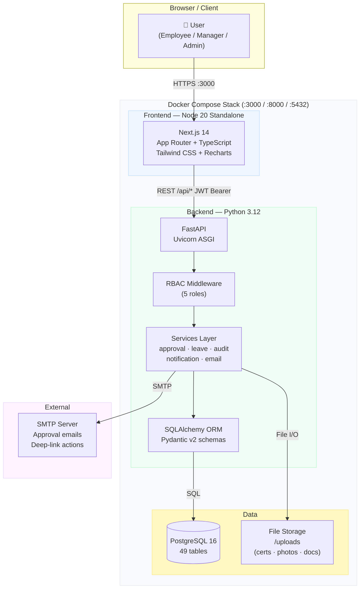
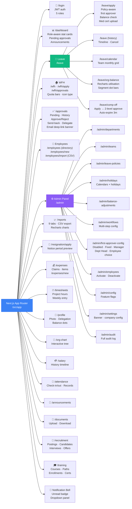
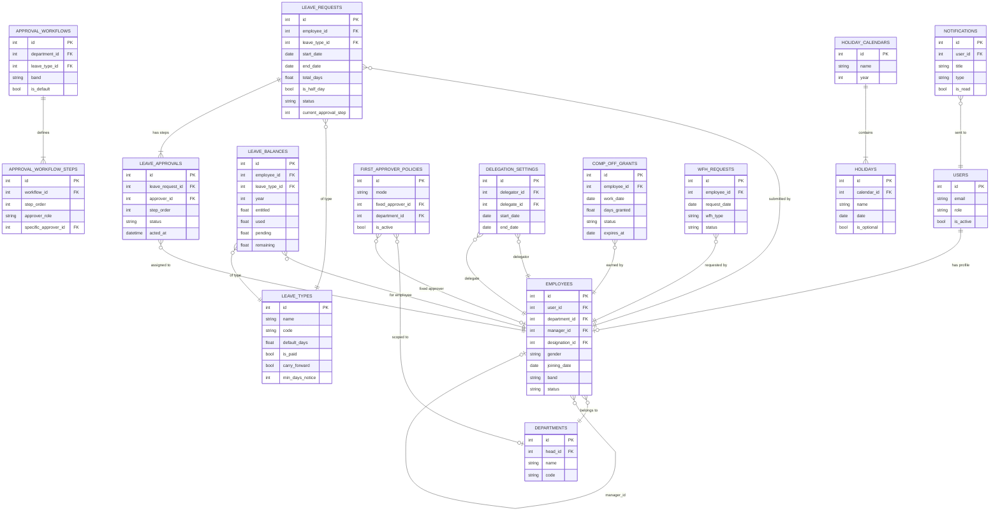
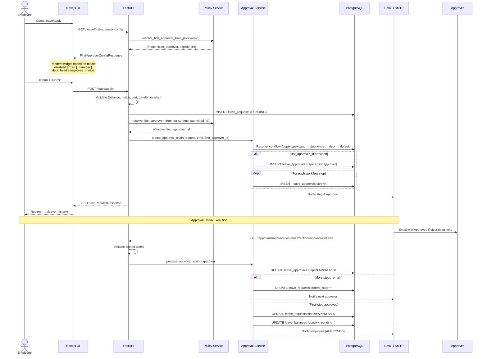
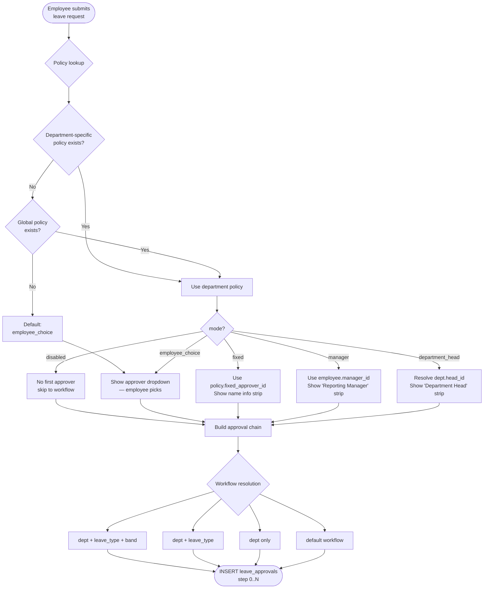
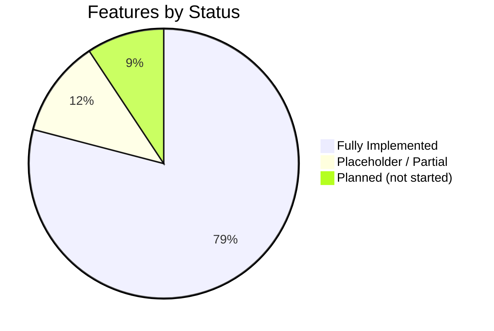

# DataSafeguard HR Platform — Architecture Diagrams

> Last updated: 2026-04-08  
> Stack: Next.js 14 · FastAPI · PostgreSQL 16 · Docker Compose

---

## 1. System Architecture

---

## 2. Frontend Module Map

---

## 3. Backend API Map

```mermaid
graph LR
    API["FastAPI\n/api"]

    API --> AAUTH["Auth\nPOST /auth/login\nGET  /auth/me\nPOST /auth/register"]

    API --> AEMP["Employees\nGET  /employees\nPOST /employees\nPUT  /employees/{id}\nDELETE /employees/{id}\nPOST /employees/bulk-import"]

    API --> ALEAVE["Leave\nGET  /leave/types  (gender-filtered)\nPOST /leave/apply\nGET  /leave/balance\nGET  /leave/balance-check\nGET  /leave/my-requests\nPOST /leave/{id}/cancel\nGET  /leave/org-balance\nGET  /leave/calendar\nGET  /leave/first-approver-config\nGET  /leave/eligible-first-approvers\nPOST /leave/upload-attachment\nGET  /leave/comp-off/my-requests\nPOST /leave/comp-off"]

    API --> AAPPR["Approvals\nGET  /approvals/pending\nPOST /approvals/{id}/action\nGET  /approvals/history\nGET  /approvals/approve-via-email"]

    API --> AWFH["WFH\nGET  /wfh\nPOST /wfh\nGET  /wfh/approvals\nPOST /wfh/{id}/action"]

    API --> AADMIN["Admin\nCRUD /admin/departments\nCRUD /admin/teams\nCRUD /admin/leave-types\nCRUD /admin/leave-policies\nCRUD /admin/workflows\nCRUD /admin/first-approver-policies\nCRUD /admin/holidays · /calendars\nPOST /admin/balance-adjustments\nGET  /admin/features\nGET/PUT /admin/settings\nGET  /admin/banner"]

    API --> AREP["Reports\nGET /reports/employees/csv\nGET /reports/leave-summary/csv\nGET /reports/attendance/csv\nGET /reports/leave-utilization\nGET /reports/headcount\nGET /reports/pending-approval-aging\nGET /reports/absenteeism-trends\nGET /reports/comp-off-status"]

    API --> AMISC["Other Modules\nGET/POST /salary\nGET/POST /attendance\nGET/POST /documents\nGET/POST /notifications\nGET/POST /announcements\nGET/POST /expenses\nGET/POST /timesheets\nGET/POST /recruitment\nGET/POST /training\nGET/POST /resignation\nGET/POST /delegations\nGET      /org-chart\nGET      /dashboard/stats\nGET      /audit"]

    style API fill:#f59e0b,color:#fff,stroke:#d97706
    style AADMIN fill:#8b5cf6,color:#fff,stroke:#7c3aed
    style ALEAVE fill:#10b981,color:#fff,stroke:#059669
    style AREP fill:#3b82f6,color:#fff,stroke:#2563eb
```

---

## 4. Database Schema (Key Relationships)

---

## 5. Leave Application & Approval Flow

---

## 6. First Approver Policy Resolution

---

## 7. Role-Based Access Map

```mermaid
graph TD
    subgraph Roles
        SA["🔑 super_admin"]
        HR["👩‍💼 hr_admin"]
        MGR["👔 manager"]
        APR["✅ approver"]
        EMP["👤 employee"]
    end

    subgraph Pages
        ADMIN_PANEL["Admin Panel\n/admin/*"]
        REPORTS_PAGE["Reports\n/reports"]
        APPROVALS_PAGE["Approvals\n/approvals"]
        LEAVE_PAGES["Leave Apply/History\n/leave/*"]
        WFH_PAGES["WFH\n/wfh/*"]
        COMP_OFF["Comp-Off\n/leave/comp-off"]
        SALARY_PAGE["Salary\n/salary"]
        ORG_BALANCE["Org Balance\n/leave/org-balance"]
    end

    SA -->|Full access| ADMIN_PANEL
    HR -->|Full access| ADMIN_PANEL
    SA & HR -->|Full access| REPORTS_PAGE
    SA & HR & MGR & APR -->|Pending/History| APPROVALS_PAGE
    SA & HR & MGR & APR & EMP -->|Own requests| LEAVE_PAGES
    SA & HR & MGR & APR & EMP -->|Own requests| WFH_PAGES
    SA & HR & MGR & APR & EMP -->|Own requests| COMP_OFF
    MGR & SA & HR -->|Team view| ORG_BALANCE
    SA & HR -->|All employees| SALARY_PAGE
    EMP -->|Own salary| SALARY_PAGE

    style SA fill:#7c3aed,color:#fff
    style HR fill:#0891b2,color:#fff
    style MGR fill:#059669,color:#fff
    style APR fill:#d97706,color:#fff
    style EMP fill:#64748b,color:#fff
```

---

## 8. Feature Implementation Status

### Implemented Modules

| Module | Key Capabilities |
|--------|-----------------|
| **Authentication** | JWT login/logout, bcrypt, RBAC (5 roles), route protection |
| **Leave Management** | Apply, balance check, half-day, cancel, history, timeline, gender filter (no ML for males) |
| **Leave Approval Engine** | Multi-step configurable workflow, approve/reject/send-back/delegate, email deep-links |
| **First Approver Policy** | 5 modes: disabled / employee_choice / fixed / manager / department_head; dept-scope + global |
| **Comp-Off** | Apply → 2-level approval → balance credited → auto-expire 3 months |
| **WFH Requests** | Quota bars, icon-based type selector, manager approval |
| **Delegation Settings** | Manager sets OOO delegate with date range; auto-routed in approval chain |
| **Holiday Calendar** | Per-calendar, national/regional/optional, excluded from day calculations |
| **Leave Policies** | Quota, carry-forward, required docs, min notice, paid/unpaid |
| **Balance Adjustments** | Admin manual override with reason + audit trail |
| **Approval Workflows** | Dept+type+band matching, department head / manager / specific / hr_admin roles |
| **Employee Management** | CRUD, bulk CSV import, deactivate, pro-rated balance init |
| **Org Leave Balance** | Team view with Recharts utilisation chart, segment dot bars, expand-per-employee |
| **Team Calendar** | Monthly grid with leave chips per day |
| **Resignation** | Apply, notice period preview, blocks leave during notice |
| **Expenses** | Claims, items, receipt upload, approval |
| **Timesheets** | Project-based weekly time entry, billable tracking |
| **Recruitment** | Job postings, candidates, interviews, offer letters |
| **Training** | Courses, learning paths, enrollments, certifications |
| **Salary** | History timeline, salary records |
| **Attendance** | Check-in/out, records, summary |
| **Documents** | Upload, download, categorize |
| **Notifications** | In-app bell, unread badge, mark read |
| **Announcements** | Company-wide, priority levels, expiry |
| **Org Chart** | Interactive employee hierarchy tree |
| **Reports** | 9 tabs with Recharts charts + CSV export |
| **Audit Log** | Full system activity log |
| **Dashboard** | Role-aware stat cards, quick actions |
| **Admin Panel** | Departments, teams, policies, workflows, holidays, settings, feature flags, banner |

### Planned / Not Started

| Feature | Notes |
|---------|-------|
| Monthly accrual cron job | EL +1/month, US PTO +1.25/month |
| Year-end carry-forward automation | January 1st processing |
| Birthday/anniversary auto-leave | Daily check, auto-approve |
| Mobile-responsive optimization | Hamburger sidebar, card tables |
